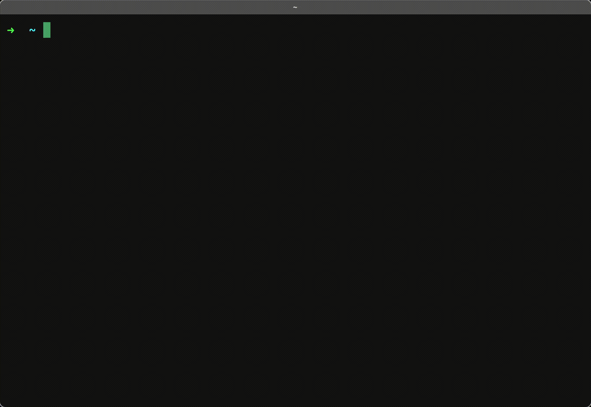

<p align = center>
<b style="font-size: 30px;">ASCII_CUBE</b><br/>
<a href="https://github.com/mmemoo/ascii_cube"></a><br />
</p>

**how to run :**


  windows :
  
  ```
  git clone https://github.com/mmemoo/ascii_cube

  cd ascii_cube

  python main.py
  ```


  linux/mac os :

  ```
  git clone https://github.com/mmemoo/ascii_cube

  cd ascii_cube

  python3 main.py
  ```
